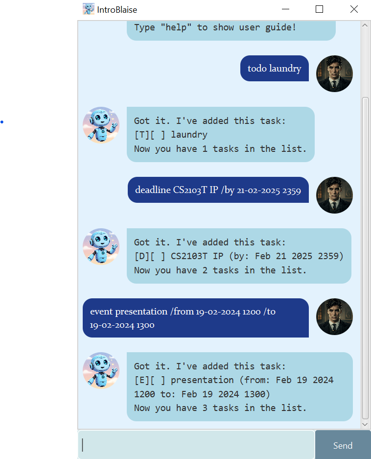

# IntroBlaise User Guide



Welcome to **IntroBlaise**, an introverted bot named Blaise! Your friendly task management bot! IntroBlaise helps you organize your tasks efficiently using simple commands.

---
## 📌 Features & Commands

### 1️⃣ Adding a To-Do Task: `todo`
Adds a simple to-do task to your list.

**Format:**
```
todo [DESCRIPTION]
```
**Example:**
```
todo laundry
```
**Response:**
```
Got it. I've added this task:
[T][ ] laundry
Now you have 1 task in the list.
```

---
### 2️⃣ Adding a Deadline Task: `deadline`
Adds a task with a specific due date.

**Format:**
```
deadline [DESCRIPTION] /by [dd-mm-yyyy HHmm]
```
**Example:**
```
deadline CS2103T IP /by 21-02-2025 2359
```
**Response:**
```
Got it. I've added this task:
[D][ ] CS2103T IP (by: Feb 21 2025 23:59)
Now you have 2 tasks in the list.
```

---
### 3️⃣ Adding an Event Task: `event`
Adds an event with a specific start and end time.

**Format:**
```
event [DESCRIPTION] /from [dd-mm-yyyy HHmm] /to [dd-mm-yyyy HHmm]
```
**Example:**
```
event presentation /from 19-02-2025 1200 /to 19-02-2025 1300
```
**Response:**
```
Got it. I've added this task:
[E][ ] presentation (from: Feb 19 2025 12:00 to: Feb 19 2025 13:00)
Now you have 3 tasks in the list.
```

---
### 4️⃣ Viewing Your Task List: `list`
Displays all tasks in your list.

**Format:**
```
list
```
**Example:**
```
list
```
**Response:**
```
1. [T][ ] laundry
2. [D][ ] CS2103T IP (by: Feb 21 2025 23:59)
3. [E][ ] presentation (from: Feb 19 2025 12:00 to: Feb 19 2025 13:00)
```

---
### 5️⃣ Marking a Task as Done: `mark`
Marks a task as completed.

**Format:**
```
mark [TASKINDEX]
```
**Example:**
```
mark 1
```
**Response:**
```
Well done! I've marked this task as done:
[T][X] laundry
```

---
### 6️⃣ Unmarking a Task: `unmark`
Marks a task as incomplete.

**Format:**
```
unmark [TASKINDEX]
```
**Example:**
```
unmark 1
```
**Response:**
```
OK, I've marked this task as not done yet:
[T][ ] laundry
```

---
### 7️⃣ Deleting a Task: `delete`
Removes a task from the list.

**Format:**
```
delete [TASKINDEX]
```
**Example:**
```
delete 1
```
**Response:**
```
Noted. I've removed this task:
[T][ ] laundry
Now you have 2 tasks in the list.
```

---
### 8️⃣ Searching for Tasks by Date: `tasks on`
Finds tasks (deadlines/events) occurring on a specific date.

**Format:**
```
tasks on [dd-mm-yyyy]
```
**Example:**
```
tasks on 19-02-2025
```
**Response:**
```
[E][ ] presentation (from: Feb 19 2025 12:00 to: Feb 19 2025 13:00)
```

---
### 9️⃣ Searching for Tasks by Keyword: `find`
Finds tasks that contain the given keyword.

**Format:**
```
find [KEYWORD]
```
**Example:**
```
find IP
```
**Response:**
```
Here are the matching tasks in your list:
1. [D][ ] CS2103T IP (by: Feb 21 2025 23:59)
```

---
### 🔟 Tagging a Task: `tag`
Adds a label to a task for easy identification.

**Format:**
```
tag [TASKINDEX] [LABEL]
```
**Example:**
```
tag 1 assignment
```
**Response:**
```
Task tagged: [D][ ] |assignment| CS2103T IP (by: Feb 21 2025 23:59)
```

---
### 1️⃣1️⃣ Removing a Tag: `untag`
Removes the label from a task.

**Format:**
```
untag [TASKINDEX]
```
**Example:**
```
untag 1
```
**Response:**
```
Tag for [D][ ] |assignment| CS2103T IP (by: Feb 21 2025 23:59) has been successfully removed!
```

---
### 1️⃣2️⃣ Clearing task list: `clear`
Clears the entire task list.

**Format:**
```
clear
```
**Example:**
```
clear
```
**Response:**
```
Yay! Your task list has been cleared!
```

---
### 1️⃣3️⃣ Displaying valid commands `help`
Shows a list of valid commands.

**Format:**
```
help
```
**Example:**
```
help
```
**Response:**
```
Hi! Here are the valid commands for IntroBlaise:
1. todo [DESCRIPTION]: Add a To-Do task
2. deadline [DESCRIPTION] /by [dd-mm-yyyy HHmm]: Add a Deadline task
3. event [DESCRIPTION] /from [dd-mm-yyyy HHmm] /to [dd-mm-yyyy HHmm]: Add an Event task
4. list: View all tasks
5. mark [TASKINDEX]: Mark a task as done
6. unmark [TASKINDEX]: Unmark a task as not done
7. delete [TASKINDEX]: Delete a task
8. tasks on [dd-mm-yyyy]: Search tasks by date
9. find [KEYWORD]: Search tasks by keyword
10. tag [TASKINDEX] [LABEL]: Add a tag to a task
11. untag [TASKINDEX]: Remove a tag from a task
12. clear: Clears the entire task list
13. help: Show this help message";
```


---
## 🎯 Conclusion
With **IntroBlaise**, managing your tasks is simple and efficient. Use the commands above to stay organized and never miss a deadline again!

📌 Happy task managing! 🚀

